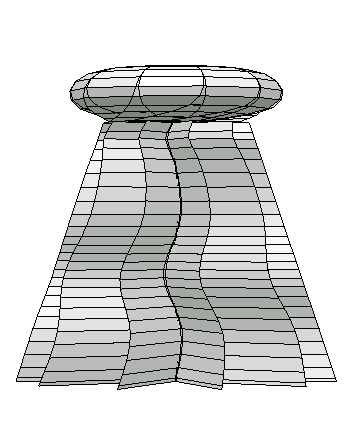

There are two jellyfish here: jellyfish and jellyfish3. You probably want jellyfish3, it is a pretty easy fold and shaping tentacles is fun. 

Here it is made with kami:

Note that the tentacles get shaped by reverse folding edges to get more texture and then curling the paper for waviness. Some waviness comes from the crease pattern but mostly it is you.

# Jellyfish, the original

As for jellyfish, the original, this jellyfish is an abomination to fold, about halfway through, you start needing clamps to hold the legs in place and then the only way to get it all to stay is to mist it with water while the clamps are stil on. 

It is the green one in the [octopus examples image](../octopus/octos_example.jpeg).

## Development
This was an accident. Conical style pattern can have blade style pleats (as see in [octopus](../octopus)) or 3d style pleat (as with [Mitani's Whipped Cream](MitaniWhippedCream.PNG)). I wanted to make an octopus with 3d pleats but went a little too far with ORI-REVO, not realizing it doesn't check that the paper doesn't cross itself (physical impossibility). 

If that didn't make sense, I recommend [Mitani's 3D Origami Art](https://www.amazon.com/3D-Origami-Art-Jun-Mitani-ebook-dp-B01HELDDX8/dp/B01HELDDX8) as a mathy sort of book looking at mostly curved designed.

# Generation
For each, I saved as crease pattern dfx, opened in ORIPA, saved as SVG. Then used Affinity Designer on ipad to redraw the lines of interest.

I've also been using SVGO [web version](https://jakearchibald.github.io/svgomg/) to clean up SVG files.