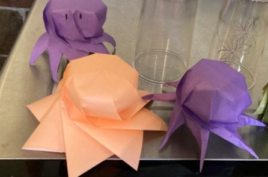
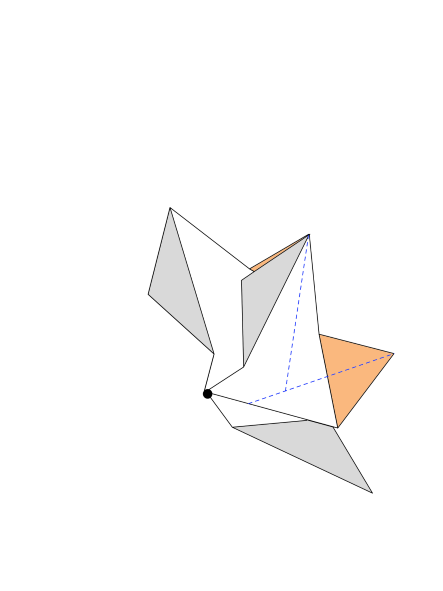

To fold the octopus, you must precrease the curved parts and the lines they are adjacent to (octopus_precrese.svg). Crease the straights (straight mountains become the top of the piece) then crease the curves, making sure to let the paper curve as you do it. Sharp edges are better, naturally. As you collapse it down, you'll need to fiddle with the arms so they go up-down-up-down. 

At this point, you'll have the peach colored octopus in the example image. 

This body should be folded dry and is easier to fold with a weightier paper (light cardstock 40lb or greater). Watercolor paper (130lb) is tough for shaping the arms but works well with some determination and makes for some nice decoration possibilities (pink and white octos in example image). I am a sucker for capillary action and using salt to mottle the watercolor effects. This can be folded with kami but it is tough to do neatly (see purple octos in image). Though the kami is nice because you can blow up the octopus like a waterbomb.

Dry fold the arms to get good creases but then dampen to give more life. You can dampen the body too but it isn't likely to have much effect.

Once you've gotten the initial body, you'll need to shape further to get arms. If you turn over the octopus, you'll see a star pattern.

Valley fold where indicated, repeat on all eight arms.

Unfold and then create a swivel fold along the crease.

The placement of the second crease is a little up to you. If you fold it as far as you can, it will make a thinner arms but be more difficult to deal with and may cause some webbing between the arms. Going about midway for an easier time, it will look like this:

Repeat 8 times.

If you are trying for a maximum arm length, you may need to do another swivel fold to get rid of the between arm webbing.

# Development 
My octopus owes a lot to Jun Mitani's Egg Wrapping for the shape and to [Ilan Garibi's 8 Pointed Flowery Star](https://origamiusa.org/thefold/article/diagrams-8-pointed-flowery-star) for the arms.

I used Mitani's [ORI-REVO](http://mitani.cs.tsukuba.ac.jp/origami_application/) to create the precrease pattern, trying to get long arms and blades that didn't stick out much. I saved as DFX Crease pattern, then used [ORIPA](http://mitani.cs.tsukuba.ac.jp/oripa/) to get to an SVG pattern with lots of extra lines. From there, it went to Affinity Designer (iPad) where I retraced the lines of interest. 

