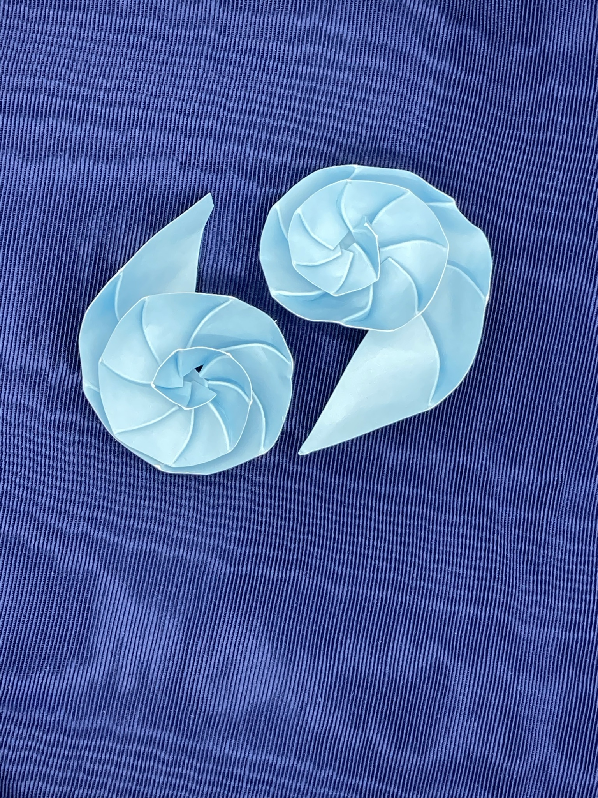
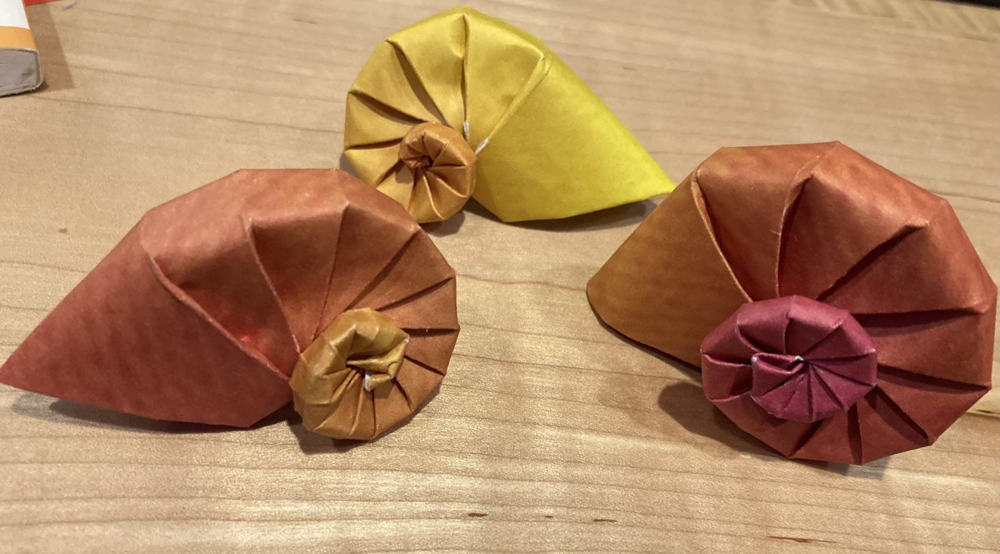
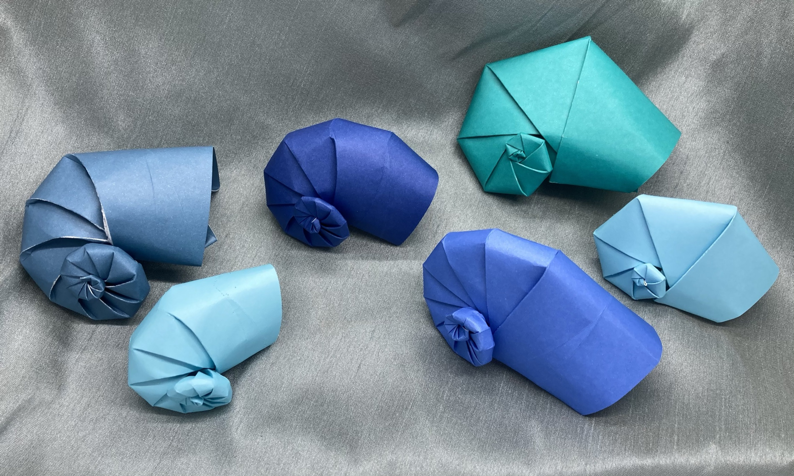
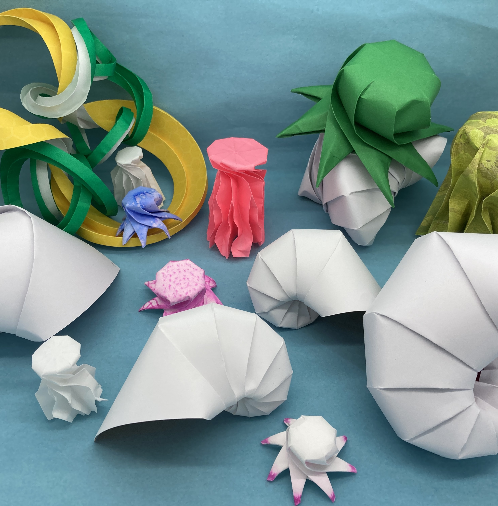

I sort of made a seashell by accident and then I wanted a intentional seashell. After a mistake or hundred, I finally got some shells I'm pleased with. I also made a Python script to generate different shells with different coiling and whorl rates.

Let's start with easiest one to fold.

# Nautilus halfshell #

Want to see [inside a nautilus](pics/nautilus_halfshell.jpeg)? This is a tough fold but not impossible, see [nautilus_halfshell.svg](nautilus_halfshell.svg).

The SVG was generated with the python script [lommel_shellgen.py](lommel_shellgen.py) so if you want to play with number of coils (N) or number of whorls per coil (r), have fun. 

# Folding Method #
Score the inner lines on , cut the outer ones (the black ones). Fold up and down (the first mountain fold on the big end will be the outside of the shell). 
More tips: You'll need to curving the paper so you can create a crease where the score mark is. Because the curving will go one way and then the other, I recommend folding all the mountains (every other line) then all the valleys (remaining lines). Crease fiercely at the ends of the paper. When the creases are in place, start at the small end, folding the septa (the inner parts of the nautilus) along the creases you made. Don't worry about the spiraling of the paper, it probably starts looking like a staircase. At the end, put it all on one plane, and you get a nautilus half shell.

This works with light cardstock (easier) and kami (harder).

# Snail Shell #

For a harder fold but a whole snail, I have a different script. Note that the hardest part of this is the tip (and keeping the tip outside the shell). If you are really going to use this, contact me (the embedded.fm contact link will do) and I can walk you through the tricky parts (and maybe add to my documentation).

I received Tomoko Fuse's Spirals as a gift and decided to change it all. Her Navel Shells and Ammonites are very close to what I've been doing (but she works with straight lines which [produce curved outlines but pretty flat shells](pics/NavelShellsFromSpiralsBook.jpeg)). The Ammonite pattern given in the book has parameters (central angle which describes how fast the shell grows and an angle of spirality that describes how fast the whorls happen). 

In Fuse’s Spirals book but she has a central angle (~growth) and angle of spirality (~whorls). She gives these as numbers for master pattern and leaves the pattern generation to the user, suggesting protractors and templates. I made a new Python script using her methodology [fuse_shellgen](fuse_shellgen.py). While the Python script will generate these flat-fold versions, since it isn't my pattern, I'm not going to put an svg in the repo. 

However, I modified it to use Bezier curves. I'm mostly [happy with the results](pics/curvedCreaseAmonnites.jpeg). If you want a pattern to try, [snailShell.svg](snailShell.svg) is available for your pre-scoring, cutting and folding pleasure. The outside is defined by the first mountain fold at the big end.

But there are a lot of parameters that cause different characteristics in the result (both for real shells and for origami shells). The two important ones are the rate the shell expands and the number of whorls per rotation.

Let's see some of these parameters:
* Left most top and bottom: ca=45, sa=15, ptb=0.90
* Middle top (darker): ca=45, sa=15, ptb=0.95
* Middle bottom: ca=45, sa=15, ptb=1.0 (straight)
* Right pair: ca=50, sa=25, ptb=1.0 (straight)

(I love a parametric search for optimum results.)

Starting with the right most, the shells are chunky, almost hexagonal. With a ptb of 1.0, the lines are straight, no curve. The shell grows too big for its spirality; if there were more whorls it wouldn't look so blocky (lower sa). Or if it grew more slowly (lower ca).

Now for the middle bottom, also with ptb=1.0 so straight lines. With a ca=45, sa=15, both growth and whorl rate have gotten away from the chunkiness. It ends up being nice round and a good example of a lovely shell origami (Fuse’s book is awesome).

The middle top (dark one) has the same sa and ca (45, 15) but a ptb=.95 so some curving in the pattern. I like it better than the original (though you can no longer use a protractor to create the pattern and prescoring is required).

Now for the left most ones (the steel blue and light blue). These have the same ca and sa (45, 15) but a ptb of 0.90, which is actually a lot of curve. Folding them was tough and you can see the paper isn’t happy (the white showing is stress on the paper).

You can really see the too-much curve differences on the back of the snails where the folds were really too stressed (left pair). The flat folds have a, well, flatness to the shells so I like my ptb=0.95 the best still, at least for this central angle and spirality. That is the one committed as [snailShell.svg](snailShell.svg). A simpler one is [simpleSnailShell.svg](simpleSnailShell.svg) (ptb=0.95, ca 45, sa 15, N12), it works well with 6" chiyogami paper (and is easier in kami).

# Backstory #

Note, [Shell_t.svg](shell_t.svg) creates a generic shell-like object. This was an accidental find when it became clear that [the toroid bowl](../other/toroidbowl.svg) was not foldable. I cut it in half (the actual paper) and the two result made nice, somewhat generic shells.

The nautilus was a more directed effort. After trying to fold the Chambered Nautilus in [Origami Sea Life](https://www.amazon.com/dp/B01LXN1AGC/) and getting stuck (again!) on step 21: the unholy crimping, I looked at the pattern and wondered if I could re-create it with curves. I got out some log-log paper and estimated some curves (ok, then I did it a few more times). I used to have the pattern here but the Fuse-based version is much better, this was difficult to fold and while the outer part of the fold looked ok but the paper curls under and the underside is pretty unsightly. These are the nautilus shells in the [paper aquarium image](pics/paperAquarium.jpeg).

I came across "Paper Nautili: A Model for Three Dimensional Planispiral Growth" by Arle Lommel in [Origami4](https://www.amazon.com/Origami-4-AK-Peters-ebook/dp/B00UVB3ROY/) (it is in the kindle preview). The method described there is for finding the ratios of the spiral an growth. I made a [python script](lommel_halfshellgen.py) to recreate the pattern in the paper and be able to modify it. However, the paper creates a disappointingly flat spiral. However, I modified the script to use Bezier curves so I could try out different curve methods. Note that the goal here is to create a half-shell, open so you can see the septa (see above). 

You can use the double parameter and the offset function to create a pair of of shells that fit together (thereby folding them as a single shell). I'm still experimenting with them, the haven't been to my liking.

Then I received Tomoko Fuse's Spirals and decided to change it all, including creating new python script using her methodology [fuse_shellgen](fuse_shellgen.py). 

As for real shells, they also obey parameters in a very interesting way, search for *Raup shell morphospace* or [read this overview](https://www.deepseanews.com/2015/07/digital-seashells-and-david-raup/).